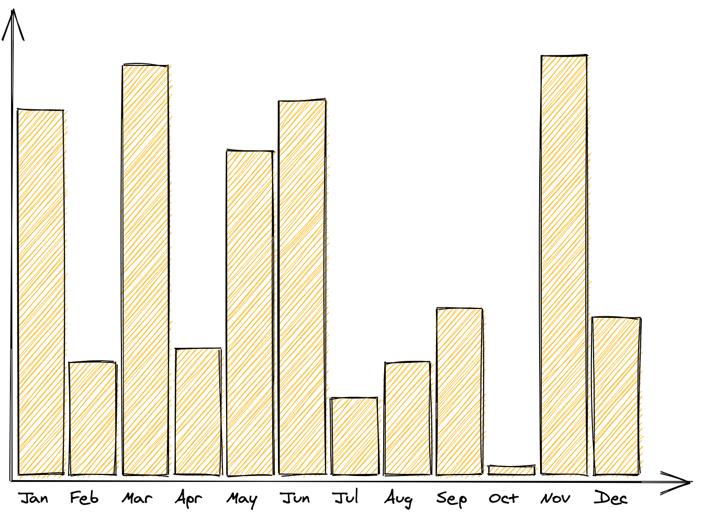
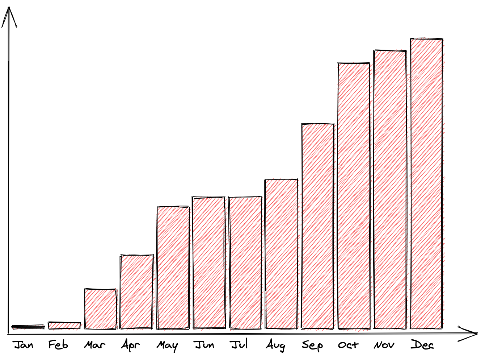

# Generate column charts

## How to use it

- Create a `.csv` file or update the [`data1.csv`](data1.csv)
- Update the `SOURCE` in the [`chart.py`](chart.py)
- Execute `python3 chart.py`
- Drag and drop `chart.excalidraw` into [excalidraw.com](https://excalidraw.com)

## Examples

