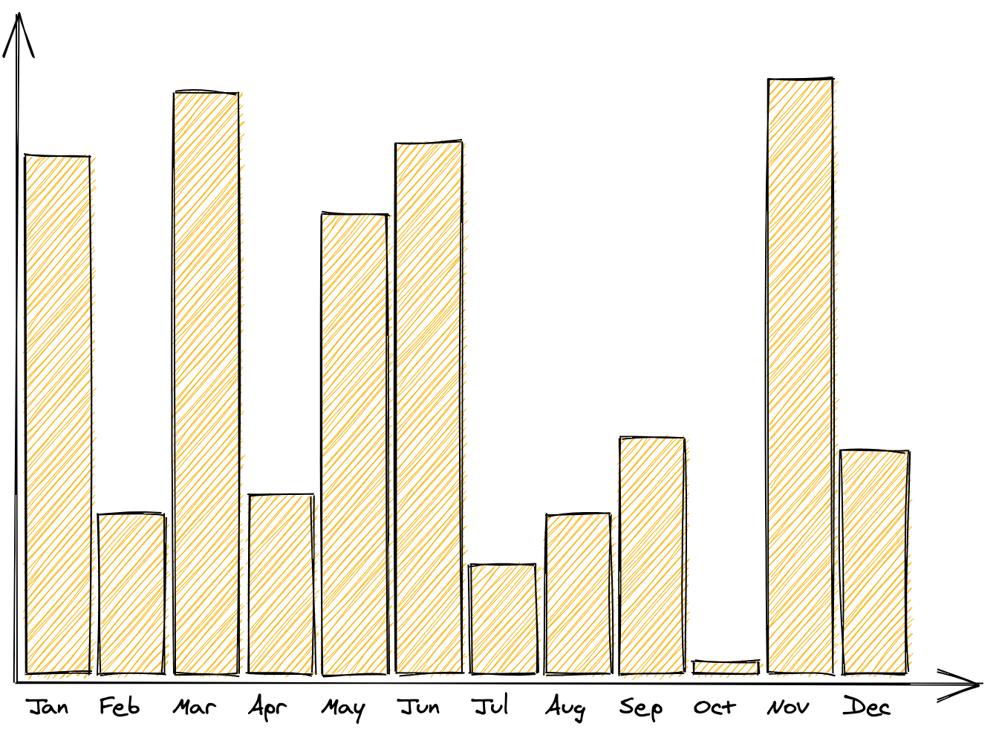
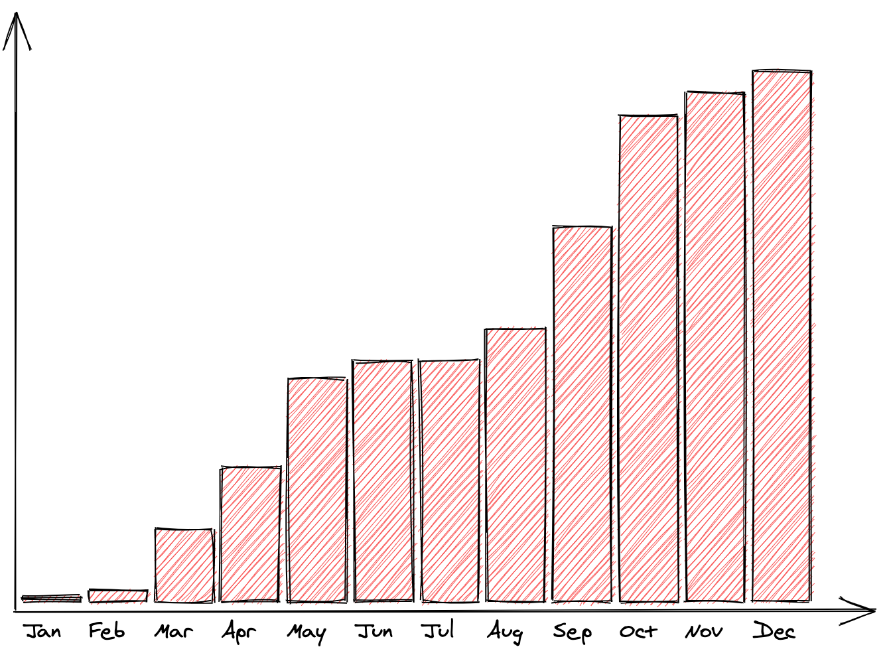

# Generate column graphs

## How to use it

- Create a `.csv` file or update the [`data.csv`](data.csv)
- Update the `SOURCE` in the [`graph.py`](graph.py)
- Execute `python3 graph.py`
- Drag and drop `graph.excalidraw` into [excalidraw.com](https://excalidraw.com)

## Examples

